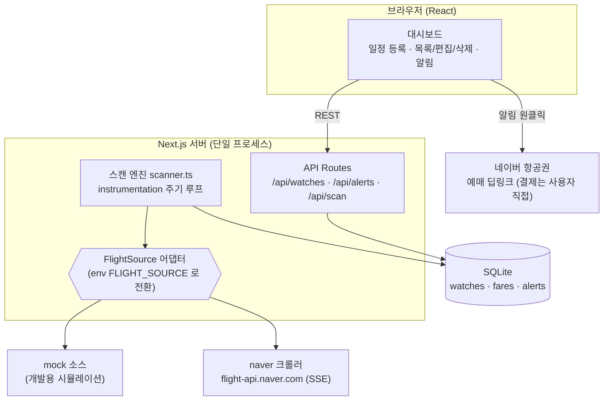

> 최종 수정: 2026-08-27 · 관련 코드: src/lib/scanner.ts, src/lib/sources/, src/app/api/

# 시스템 아키텍처

```mermaid
flowchart TB
  subgraph Client["브라우저 (React)"]
    UI["대시보드<br/>일정 등록 · 목록/편집/삭제 · 알림"]
  end

  subgraph Server["Next.js 서버 (단일 프로세스)"]
    API["API Routes<br/>/api/watches · /api/alerts · /api/scan"]
    SCAN["스캔 엔진 scanner.ts<br/>instrumentation 주기 루프"]
    SRC{{"FlightSource 어댑터<br/>(env FLIGHT_SOURCE 로 전환)"}}
  end

  DB[("SQLite<br/>watches · fares · alerts")]
  MOCK["mock 소스<br/>(개발용 시뮬레이션)"]
  NAVER["naver 크롤러<br/>flight-api.naver.com (SSE)"]
  EXT["네이버 항공권<br/>예매 딥링크 (결제는 사용자 직접)"]

  UI -- REST --> API
  API --> DB
  SCAN --> SRC
  SRC --> MOCK
  SRC --> NAVER
  SCAN --> DB
  UI -- "알림 원클릭" --> EXT
```
