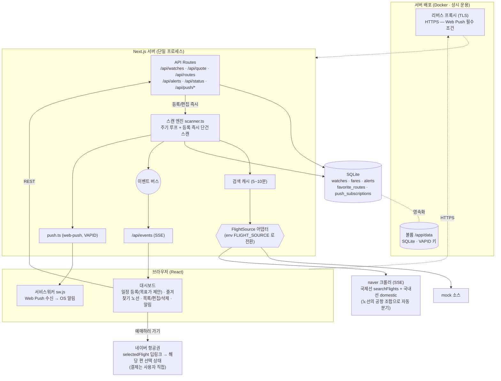

> 최종 수정: 2026-09-02 · 관련 코드: src/lib/scanner.ts, src/lib/sources/, src/lib/events.ts, src/lib/push.ts, src/app/api/, README.md(서버 배포)

# 시스템 아키텍처

```mermaid
flowchart TB
  subgraph Deploy["서버 배포 (Docker · 상시 운용)"]
    PROXY["리버스 프록시 (TLS)<br/>HTTPS — Web Push 필수 조건"]
    VOL[("볼륨 /app/data<br/>SQLite · VAPID 키")]
  end

  subgraph Client["브라우저 (React)"]
    UI["대시보드<br/>일정 등록(목표가 제안) · 즐겨찾기 노선 · 목록/편집/삭제 · 알림"]
    SW["서비스워커 sw.js<br/>Web Push 수신 → OS 알림"]
  end

  subgraph Server["Next.js 서버 (단일 프로세스)"]
    API["API Routes<br/>/api/watches · /api/quote · /api/routes<br/>/api/alerts · /api/status · /api/push/*"]
    SSE["/api/events (SSE)"]
    BUS(("이벤트 버스"))
    SCAN["스캔 엔진 scanner.ts<br/>주기 루프 + 등록 즉시 단건 스캔"]
    CACHE["검색 캐시 (5~10분)"]
    SRC{{"FlightSource 어댑터<br/>(env FLIGHT_SOURCE 로 전환)"}}
    PUSH["push.ts (web-push, VAPID)"]
  end

  DB[("SQLite<br/>watches · fares · alerts<br/>favorite_routes · push_subscriptions")]
  MOCK["mock 소스"]
  NAVER["naver 크롤러 (SSE)<br/>국제선 searchFlights + 국내선 domestic<br/>(노선의 공항 조합으로 자동 분기)"]
  EXT["네이버 항공권<br/>selectedFlight 딥링크 → 해당 편 선택 상태<br/>(결제는 사용자 직접)"]

  Client -. HTTPS .-> PROXY -.-> Server
  DB -.영속화.- VOL

  UI -- REST --> API
  API --> DB
  API -- 등록/편집 즉시 --> SCAN
  SCAN --> CACHE --> SRC
  SRC --> MOCK
  SRC --> NAVER
  SCAN --> DB
  SCAN --> BUS --> SSE --> UI
  SCAN --> PUSH --> SW
  UI -- "예매하러 가기" --> EXT
```
