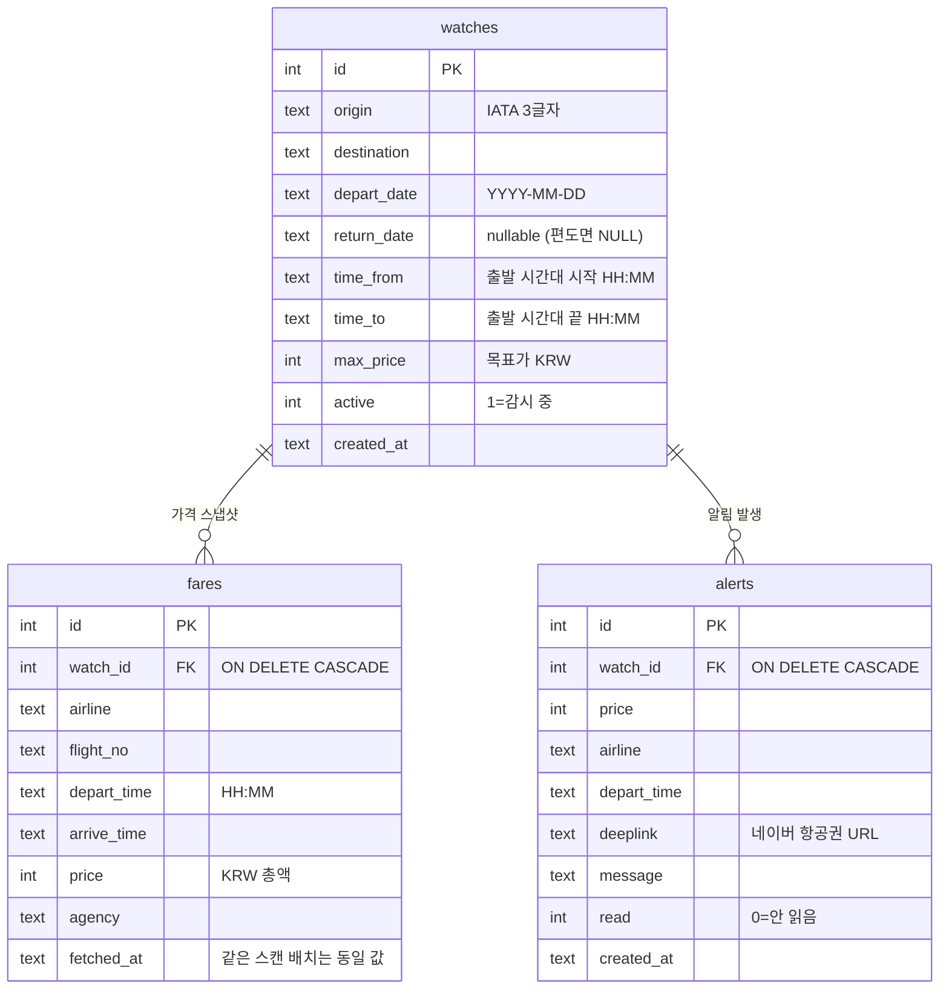

> 최종 수정: 2026-08-27 · 관련 코드: src/lib/db.ts

# DB 스키마

```mermaid
erDiagram
  watches ||--o{ fares : "가격 스냅샷"
  watches ||--o{ alerts : "알림 발생"

  watches {
    int id PK
    text origin "IATA 3글자"
    text destination
    text depart_date "YYYY-MM-DD"
    text return_date "nullable (편도면 NULL)"
    text time_from "출발 시간대 시작 HH:MM"
    text time_to "출발 시간대 끝 HH:MM"
    int max_price "목표가 KRW"
    int active "1=감시 중"
    text created_at
  }

  fares {
    int id PK
    int watch_id FK "ON DELETE CASCADE"
    text airline
    text flight_no
    text depart_time "HH:MM"
    text arrive_time
    int price "KRW 총액"
    text agency
    text fetched_at "같은 스캔 배치는 동일 값"
  }

  alerts {
    int id PK
    int watch_id FK "ON DELETE CASCADE"
    int price
    text airline
    text depart_time
    text deeplink "네이버 항공권 URL"
    text message
    int read "0=안 읽음"
    text created_at
  }
```
