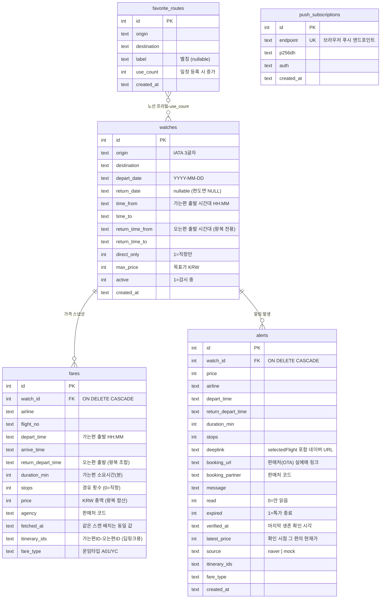

> 최종 수정: 2026-09-02 · 관련 코드: src/lib/db.ts

# DB 스키마

```mermaid
erDiagram
  watches ||--o{ fares : "가격 스냅샷"
  watches ||--o{ alerts : "알림 발생"
  favorite_routes }o..o{ watches : "노선 프리필·use_count"

  watches {
    int id PK
    text origin "IATA 3글자"
    text destination
    text depart_date "YYYY-MM-DD"
    text return_date "nullable (편도면 NULL)"
    text time_from "가는편 출발 시간대 HH:MM"
    text time_to
    text return_time_from "오는편 출발 시간대 (왕복 전용)"
    text return_time_to
    int direct_only "1=직항만"
    int max_price "목표가 KRW"
    int active "1=감시 중"
    text created_at
  }

  fares {
    int id PK
    int watch_id FK "ON DELETE CASCADE"
    text airline
    text flight_no
    text depart_time "가는편 출발 HH:MM"
    text arrive_time
    text return_depart_time "오는편 출발 (왕복 조합)"
    int duration_min "가는편 소요시간(분)"
    int stops "경유 횟수 (0=직항)"
    int price "KRW 총액 (왕복 합산)"
    text agency "판매처 코드"
    text fetched_at "같은 스캔 배치는 동일 값"
    text itinerary_ids "가는편ID-오는편ID (딥링크용)"
    text fare_type "운임타입 A01/YC"
  }

  alerts {
    int id PK
    int watch_id FK "ON DELETE CASCADE"
    int price
    text airline
    text depart_time
    text return_depart_time
    int duration_min
    int stops
    text deeplink "selectedFlight 포함 네이버 URL"
    text booking_url "판매처(OTA) 실예매 링크"
    text booking_partner "판매처 코드"
    text message
    int read "0=안 읽음"
    int expired "1=특가 종료"
    text verified_at "마지막 생존 확인 시각"
    int latest_price "확인 시점 그 편의 현재가"
    text source "naver | mock"
    text itinerary_ids
    text fare_type
    text created_at
  }

  favorite_routes {
    int id PK
    text origin
    text destination
    text label "별칭 (nullable)"
    int use_count "일정 등록 시 증가"
    text created_at
  }

  push_subscriptions {
    int id PK
    text endpoint UK "브라우저 푸시 엔드포인트"
    text p256dh
    text auth
    text created_at
  }
```
