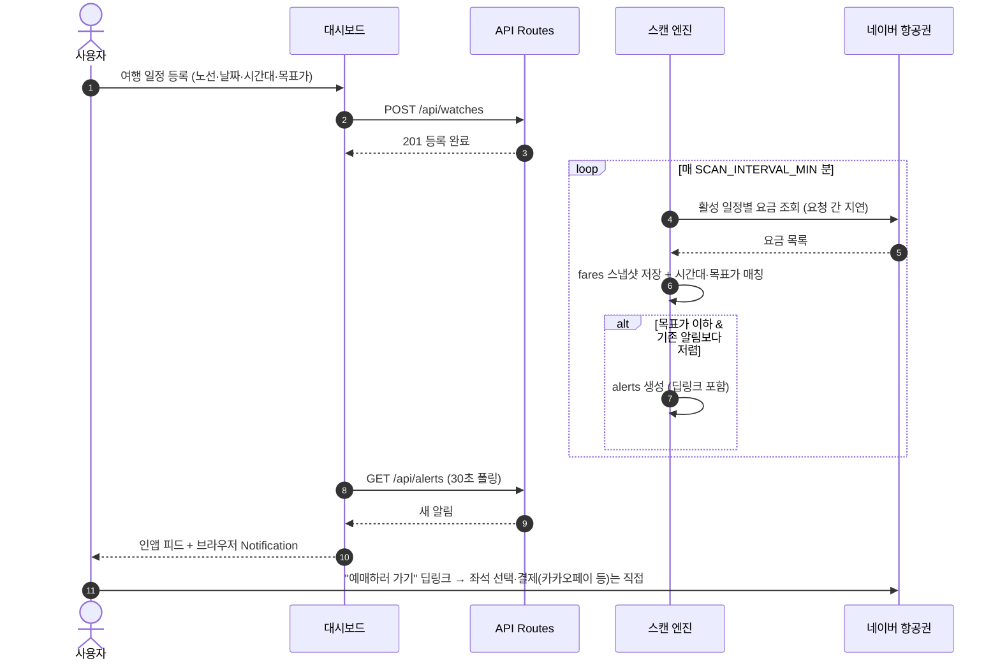

> 최종 수정: 2026-08-27 · 관련 코드: src/lib/scanner.ts, src/app/page.tsx, src/components/AlertFeed.tsx

# 감시 → 알림 → 예매 흐름

```mermaid
sequenceDiagram
  autonumber
  actor U as 사용자
  participant UI as 대시보드
  participant API as API Routes
  participant S as 스캔 엔진
  participant N as 네이버 항공권

  U->>UI: 여행 일정 등록 (노선·날짜·시간대·목표가)
  UI->>API: POST /api/watches
  API-->>UI: 201 등록 완료

  loop 매 SCAN_INTERVAL_MIN 분
    S->>N: 활성 일정별 요금 조회 (요청 간 지연)
    N-->>S: 요금 목록
    S->>S: fares 스냅샷 저장 + 시간대·목표가 매칭
    alt 목표가 이하 & 기존 알림보다 저렴
      S->>S: alerts 생성 (딥링크 포함)
    end
  end

  UI->>API: GET /api/alerts (30초 폴링)
  API-->>UI: 새 알림
  UI-->>U: 인앱 피드 + 브라우저 Notification
  U->>N: "예매하러 가기" 딥링크 → 좌석 선택·결제(카카오페이 등)는 직접
```
