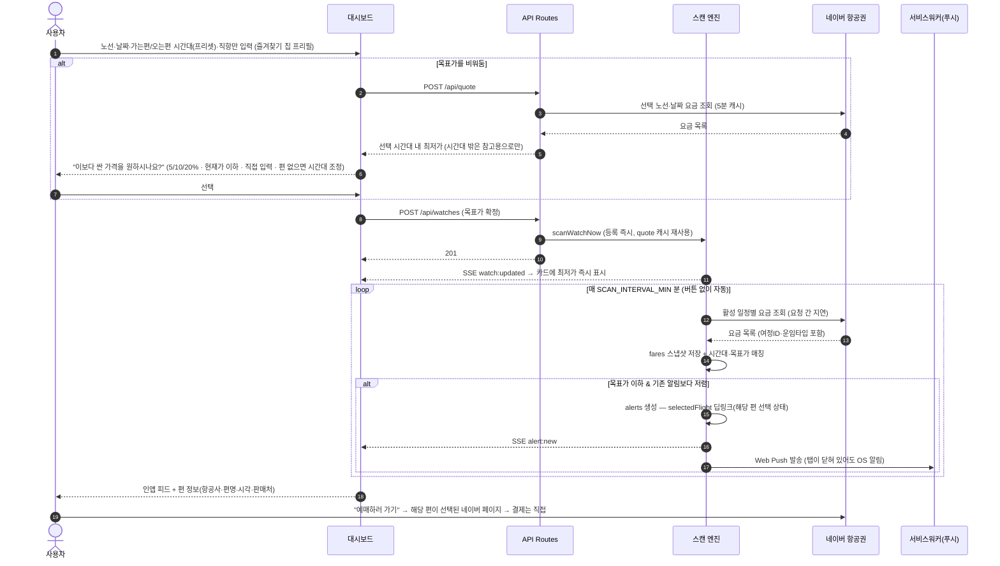

> 최종 수정: 2026-08-28 · 관련 코드: src/lib/scanner.ts, src/app/api/quote/route.ts, src/app/api/events/route.ts, src/lib/push.ts, src/app/page.tsx

# 일정 등록 → 자동 감시 → 알림 → 예매 흐름

```mermaid
sequenceDiagram
  autonumber
  actor U as 사용자
  participant UI as 대시보드
  participant API as API Routes
  participant S as 스캔 엔진
  participant N as 네이버 항공권
  participant SW as 서비스워커(푸시)

  U->>UI: 노선·날짜·가는편/오는편 시간대(프리셋)·직항만 입력 (즐겨찾기 칩 프리필)
  alt 목표가를 비워둠
    UI->>API: POST /api/quote
    API->>N: 선택 노선·날짜 요금 조회 (5분 캐시)
    N-->>API: 요금 목록
    API-->>UI: 선택 시간대 내 최저가 (시간대 밖은 참고용으로만)
    UI-->>U: "이보다 싼 가격을 원하시나요?" (5/10/20% · 현재가 이하 · 직접 입력 · 편 없으면 시간대 조정)
    U->>UI: 선택
  end
  UI->>API: POST /api/watches (목표가 확정)
  API->>S: scanWatchNow (등록 즉시, quote 캐시 재사용)
  API-->>UI: 201
  S-->>UI: SSE watch:updated → 카드에 최저가 즉시 표시

  loop 매 SCAN_INTERVAL_MIN 분 (버튼 없이 자동)
    S->>N: 활성 일정별 요금 조회 (요청 간 지연)
    N-->>S: 요금 목록 (여정ID·운임타입 포함)
    S->>S: fares 스냅샷 저장 + 시간대·목표가 매칭
    alt 목표가 이하 & 기존 알림보다 저렴
      S->>S: alerts 생성 — selectedFlight 딥링크(해당 편 선택 상태)
      S-->>UI: SSE alert:new
      S->>SW: Web Push 발송 (탭이 닫혀 있어도 OS 알림)
    end
  end

  UI-->>U: 인앱 피드 + 편 정보(항공사·편명·시각·판매처)
  U->>N: "예매하러 가기" → 해당 편이 선택된 네이버 페이지 → 결제는 직접
```
